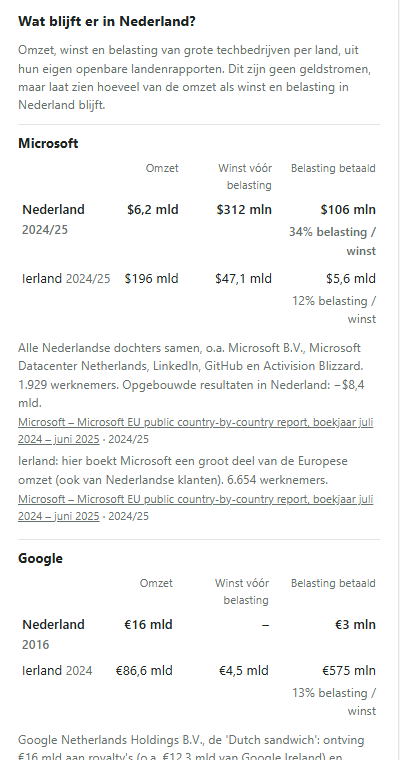
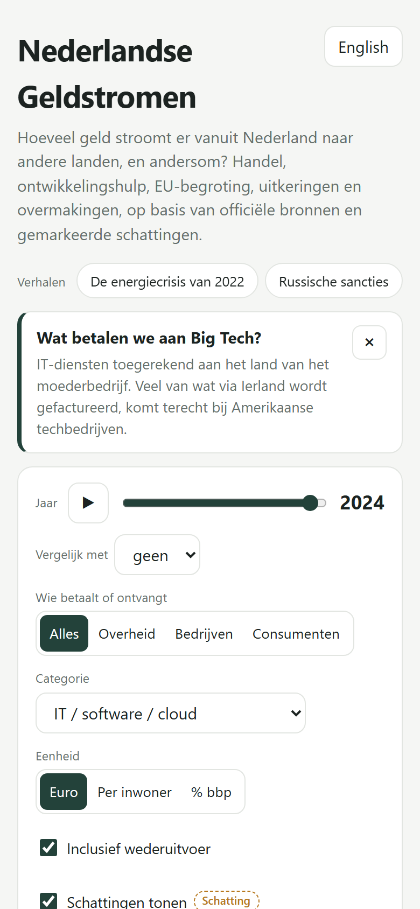
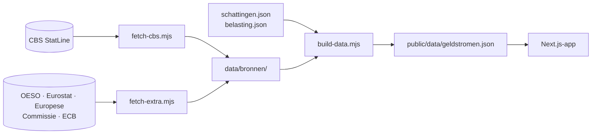

<div align="center">

# 🇳🇱 Nederlandse Geldstromen

### Hoeveel geld stroomt er vanuit Nederland naar de rest van de wereld, en hoeveel komt er terug?

Een interactieve wereldkaart van handel, ontwikkelingshulp, EU-begroting, pensioenen, overmakingen
en defensie-aankopen. Gebouwd op officiële bronnen, met bij elk bedrag de bron, het jaar en een eerlijk
label: officieel, berekend of geschat.

[](LICENSE)


**[Snel starten](#-snel-starten)** · **[Wat je ontdekt](#-wat-je-ontdekt)** · **[Functies](#-functies)** ·
**[Bronnen](#-bronnen)** · **[Methode](#-methode)** · **[English](#-english)**

</div>

---

## 🔍 Wat je ontdekt

Een paar dingen die direct uit de data komen:

| | |
|---|---|
| 🇺🇸 **De VS** | In 2025 ging er **€117,4 mld** naar de VS en kwam er **€81,9 mld** terug. Zonder doorvoer via Rotterdam is dat €83,1 mld tegenover €72,3 mld. |
| 💡 **Royalty's** | Nederland betaalde in 2024 **€21,2 mld** aan de VS voor het gebruik van intellectueel eigendom, tegen €1,5 mld terug. |
| 🏢 **Big Tech en belasting** | Microsoft had in Nederland **$6,2 mld omzet, maar $312 mln winst** en betaalde $105 mln belasting. In Ierland boekte het $47,1 mld winst. |
| 🏝️ **Doorsluizen** | Royalty's die via Nederland naar belastingparadijzen gingen, daalden van **€32,1 mld (2019) naar €0,7 mld (2024)**. |
| 🇷🇺 **Rusland** | Naar Rusland ging in 2021 nog €19,5 mld; in 2024 was dat €3,5 mld. |
| 🇪🇺 **EU** | Nederland droeg in 2024 €7,5 mld af aan de EU-begroting (inclusief invoerrechten); de EU gaf €4,5 mld uit in Nederland. |
| ⚖️ **Overschot** | Met 74 van de 121 landen is het saldo positief. Dat klopt met het officiële handelsoverschot van **€123 mld** (2025): veel landen halen hun spullen via Nederland. |

## ✨ Functies

<table>
<tr>
<td width="50%" valign="top">

**Verkennen**
- 🗺️ Interactieve kaart: zoomen, slepen, hover en bewegende stromen
- 🔎 Zoekveld, ook op de Engelse landnaam
- 📖 **Verhalen**: één klik naar "De energiecrisis van 2022", "Russische sancties", "Wat betalen we aan Big Tech?" en meer
- 📅 Jaarschuif 2002–2025 met afspeelknop
- 📊 Twee jaren vergelijken, met de groei in procenten

</td>
<td width="50%" valign="top">

**Eerlijk rekenen**
- 🚢 Met of zonder wederuitvoer (doorvoer via Rotterdam)
- 🇮🇪→🇺🇸 Factuurland of uiteindelijke ontvanger
- 🏷️ Labels officieel / berekend / schatting, en schattingen uit te zetten
- 🧾 **Wat blijft er in Nederland?**: omzet, winst en belasting van Big Tech per land
- ✅ Controle met het officiële saldo uit de nationale rekeningen

</td>
</tr>
<tr>
<td valign="top">

**Filteren**
- Wie betaalt: overheid, bedrijven of consumenten
- Tien categorieën: goederen, energie, diensten, IT/cloud, intellectueel eigendom, defensie, ontwikkelingshulp, EU-begroting, uitkeringen en overmakingen
- Euro, per inwoner of % bbp

</td>
<td valign="top">

**Delen en gebruiken**
- 🔗 Deelbare link: alle instellingen staan in de URL
- 📋 Tabelweergave en CSV-download
- 🌍 Nederlands en Engels
- 📱 Werkt op desktop en mobiel

</td>
</tr>
</table>

<table>
<tr>
<td width="50%"><br><sub>Verhaal: de energiecrisis van 2022, vergeleken met 2021</sub></td>
<td width="50%"><br><sub>Tabel per inwoner, met verandering ten opzichte van 2019</sub></td>
</tr>
<tr>
<td><br><sub>Wat blijft er in Nederland? Omzet, winst en belasting per concern</sub></td>
<td><br><sub>Op een telefoon</sub></td>
</tr>
</table>

## 🚀 Snel starten

```bash
git clone https://github.com/ProAdmin007/nederlandse-geldstromen.git
cd nederlandse-geldstromen
npm install
npm run dev
```

Open http://localhost:3000. De verwerkte data zit in de repository; je hoeft niets op te halen.

| Commando | Wat het doet |
|---|---|
| `npm run dev` | Start de app lokaal |
| `npm test` | Draait de 37 tests, ook tegen de ruwe bronnen |
| `npm run data` | Haalt alle bronnen opnieuw op en bouwt de dataset |
| `npm run build` | Maakt een statische site in `out/` |

## 🧭 Hoe het werkt



Geen database en geen backend: de app laadt één JSON-bestand (±140 kB gecomprimeerd) en rekent alles in
de browser uit. Daardoor werkt hij op elke webhost.

## 📚 Bronnen

<details open>
<summary><b>Handel (CBS StatLine)</b></summary>

| Tabel | Gebruikt voor |
|---|---|
| [85427NED](https://opendata.cbs.nl/statline/#/CBS/nl/dataset/85427NED/table) · [83028NED](https://opendata.cbs.nl/statline/#/CBS/nl/dataset/83028NED/table) | Goederen en energie per land, wederuitvoer (2015–2025; 2002–2014 oude methode) |
| [85940NED](https://opendata.cbs.nl/statline/#/CBS/nl/dataset/85940NED/table) | Deel van de invoer dat bestemd is voor wederuitvoer |
| [84765NED](https://opendata.cbs.nl/statline/#/CBS/nl/dataset/84765NED/table) · [82616NED](https://opendata.cbs.nl/statline/#/CBS/nl/dataset/82616NED/table) · [80414ned](https://opendata.cbs.nl/statline/#/CBS/nl/dataset/80414ned/table) | Diensten per land: IT, intellectueel eigendom, reisverkeer, overheid (2003–2025) |
| [85496NED](https://opendata.cbs.nl/statline/#/CBS/nl/dataset/85496NED/table) · [85879NED](https://opendata.cbs.nl/statline/#/CBS/nl/dataset/85879NED/table) | Bevolking, bbp en het officiële handelssaldo (ter controle) |

</details>

<details>
<summary><b>Overheid en overdrachten</b></summary>

| Bron | Gebruikt voor |
|---|---|
| [OESO CRS](https://data-explorer.oecd.org/) + [ECB-koers](https://data.ecb.europa.eu/) | Ontwikkelingshulp per land (2002–2024) |
| [Europese Commissie](https://commission.europa.eu/strategy-and-policy/eu-budget/long-term-eu-budget/2021-2027/spending-and-revenue_en) | EU-begroting: afdrachten, invoerrechten en EU-uitgaven in Nederland (2000–2025) |
| [Europese Commissie / HIVA](https://hiva.kuleuven.be/nl/onderzoeksmap/thema/verzorgingsstaat/p/Docs/network-statistics-ry-2024/cross-border-pensions-reference-year-2024.pdf) | Wettelijke pensioenen naar en uit EU/EFTA-landen en het VK (2024) |
| [Eurostat bop_rem6](https://ec.europa.eu/eurostat/databrowser/view/bop_rem6/default/table) | Overmakingen door migranten |
| F-35-rapportages en jaarverslagen Defensiematerieelbegrotingsfonds | Gerealiseerde defensie-aankopen per project (2015–2025) |
| Kamerbrief SLM Rijk, jaarverslagen SURF, onderzoek AD/Binnenlands Bestuur | IT-uitgaven van Rijk, hoger onderwijs en gemeenten |

</details>

<details>
<summary><b>Belasting</b></summary>

| Bron | Gebruikt voor |
|---|---|
| EU-landenrapporten van [Microsoft](https://cdn-dynmedia-1.microsoft.com/is/content/microsoftcorp/microsoft/msc/documents/presentations/CSR/FY25-Microsoft-EU-Directive-2021-2101-Report.pdf) en [Apple](https://www.apple.com/legal/more-resources/docs/Apple-Inc-EU-pCbCR-FY25.pdf), [Taxplorer](https://www.taxplorer.eu/) | Omzet, winst en belasting per land |
| Jaarrekeningen via NOS, Quote, Irish Times | Netflix, Google (Dutch sandwich), Google en Meta in Ierland |
| Kamerstuk 25087 nr. 357 (DNB), CBS 84120NED, Miljoenennota 2027, Commissie Ter Haar | Royaltystromen, bronbelasting, minimumbelasting, vennootschapsbelasting |
| [Eurostat fats_activ](https://ec.europa.eu/eurostat/databrowser/view/fats_activ/default/table) | Onderbouwing van de toerekening Ierland → VS |

</details>

## 📐 Methode

1. **Niets telt dubbel.** Wederuitvoer en schattingen die al in een officieel cijfer zitten (zoals
   defensie-aankopen binnen goederen) staan als "waarvan"-regel in de data. De app trekt ze er alleen af als
   dat nodig is, zodat het officiële totaal blijft kloppen.
2. **Breuken blijven zichtbaar.** CBS wisselde van methode in 2014, 2015 en 2020. De trendlijn breekt daar af
   en de app waarschuwt bij vergelijken.
3. **Een gat is geen nul.** Jaren die nog niet zijn gepubliceerd, zie je als gat. De app meldt ook welke
   bronnen in een jaar nog ontbreken.
4. **Saldo is geen winst.** Een positief saldo betekent meer verkopen dan aankopen. Winst die naar buitenlandse
   eigenaren gaat, zit er niet in; dat staat ook in de app.
5. **Gecontroleerd.** Het handelssaldo in de app volgt in elk jaar het officiële saldo uit de nationale
   rekeningen. Een test bewaakt dat, net als dat de totalen per land precies de CBS-cijfers zijn.

### Wat (nog) ontbreekt

- Overheids-IT is maar deels bekend (Rijk, SURF, gemeenten); zorg, scholen, provincies en waterschappen
  ontbreken, en veel defensieposten zijn vertrouwelijk.
- Maar ~15% van de ontwikkelingshulp is aan een land toe te wijzen.
- Overmakingen in de statistiek (~€1 mld) zijn veel lager dan de schatting van de Wereldbank (USD 7,8 mld).
- Pensioenen per land zijn er alleen voor Europa en voor 2024.
- De landenrapporten van Google, Meta en Amazon verschijnen pas eind 2026.
- Bewust weggelaten: dividend en rente, omdat brievenbusfirma's die cijfers sterk vertekenen.

## 🗂️ Projectstructuur

```
app/                 pagina, layout en stijl
components/          kaart, zijpaneel, tabel, trendgrafiek, zoekveld
lib/calc.ts          alle rekenregels (puur, getest)
lib/i18n.ts          teksten in het Nederlands en Engels
lib/stories.ts       de verhalen
scripts/             bronnen ophalen en data bouwen
data/                ruwe bronnen, schattingen, belasting, landenkoppeling
public/data/         gegenereerde dataset voor de app
docs/                screenshots
```

## 🤝 Bijdragen

Een bron gevonden die een gat vult? Graag!

- **Schatting toevoegen:** een regel in `data/schattingen.json`, met `partOf` als het bedrag al in een officieel
  cijfer zit, een bron in `sources` en een Engelse tekst in `note_en`.
- **Belastingcijfers:** een regel in `data/belasting.json`, bijvoorbeeld uit een nieuw landenrapport.
- Draai daarna `npm run data:build` en `npm test`.

## 🌐 Online zetten

`npm run build` maakt een statische site in `out/` die werkt op GitHub Pages, Netlify of Cloudflare Pages.
Staat de site in een submap? Zet dan `NEXT_PUBLIC_BASE_PATH=/submap` tijdens het bouwen.

## 🇬🇧 English

**Dutch Money Flows** is an interactive map of money flowing between the Netherlands and the rest of the world,
2002–2025: trade in goods and services (CBS), development aid (OECD), the EU budget (European Commission),
remittances (Eurostat), cross-border pensions, defence purchases and IT spending, plus how much US tech
companies keep in the Netherlands as profit and tax. Every amount shows its source, year and whether it is
official, calculated or an estimate. Use the button at the top right or add `?lang=en` to the URL.

## 📄 Licentie en bronvermelding

Code: [MIT](LICENSE). Cijfers: © CBS (StatLine, [CC BY 4.0](https://www.cbs.nl/nl-nl/over-ons/website/copyright)),
OESO, Eurostat, Europese Commissie, ECB en de andere genoemde bronnen, volgens hun eigen voorwaarden.
Kaart: [world-atlas](https://github.com/topojson/world-atlas) (Natural Earth).
