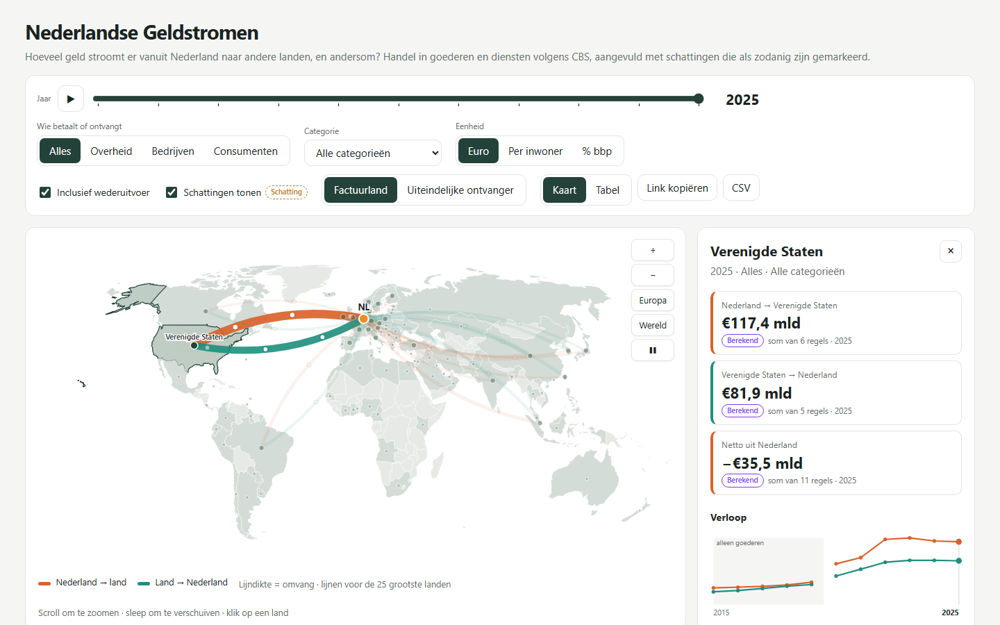
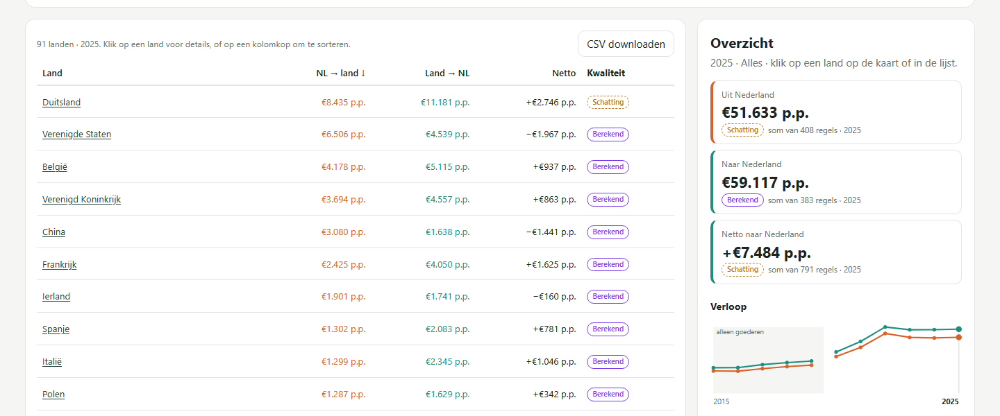
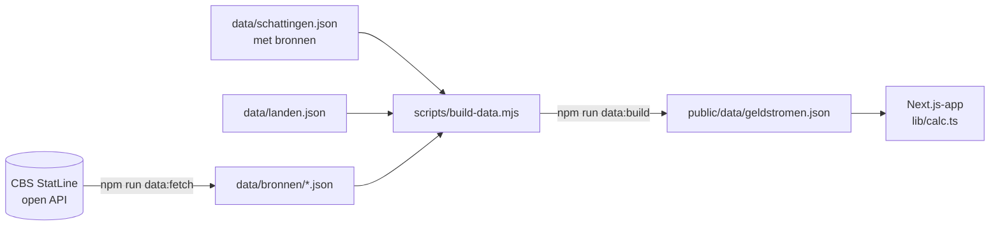

<div align="center">

# Nederlandse Geldstromen

**Hoeveel geld stroomt er vanuit Nederland naar andere landen, en andersom?**

Een interactieve wereldkaart op basis van officiële CBS-cijfers, met eerlijke labels voor wat officieel,
berekend of geschat is.




</div>

## Wat laat het zien?

Klik op een land en je ziet hoeveel geld Nederland daarheen stuurt, hoeveel er terugkomt, het saldo, de
verdeling per categorie en het verloop sinds 2015. Elk bedrag heeft een bron, een jaar en een label:

| Label | Betekenis |
|---|---|
|  | Direct uit een officiële statistiek (CBS) |
|  | Afgeleid uit officiële cijfers, zoals totaal minus energie of een aandeel wederuitvoer |
|  | Uit Kamerstukken, jaarverslagen of journalistiek onderzoek, altijd met bron |

**Enkele cijfers uit de data**

- In 2025 ging er €117,4 mld van Nederland naar de VS en kwam er €81,9 mld terug.
- Zonder wederuitvoer (goederen die alleen via Rotterdam doorreizen) is dat €83,1 mld tegenover €72,3 mld.
- In 2024 betaalde Nederland €21,2 mld aan de VS voor het gebruik van intellectueel eigendom.
- De handel met Rusland is sinds 2022 ingestort; dat zie je met de jaarschuif.

## Functies

- 🗺️ **Interactieve kaart**: zoomen, slepen, hover-tooltips en rustig bewegende geldstromen.
- 📅 **Jaarschuif 2015–2025** met afspeelknop en een trendgrafiek per land.
- 🏷️ **Filters** op wie betaalt (overheid, bedrijven, consumenten) en op categorie (goederen, energie,
  diensten, IT/cloud, intellectueel eigendom, defensie).
- 💶 **Eenheden**: euro, per inwoner of als % van het bbp.
- 🚢 **Met of zonder wederuitvoer**: doorvoer aan beide kanten aftrekken.
- 🇮🇪→🇺🇸 **Factuurland of uiteindelijke ontvanger**: IT-diensten die Amerikaanse techbedrijven vanuit Ierland
  factureren, toerekenen aan de VS.
- 🔍 **Schattingen aan/uit**, zodat je ook met alleen officiële en berekende cijfers kunt kijken.
- 📋 **Tabelweergave en CSV-download** voor onderzoekers en journalisten.
- 🔗 **Deelbare link**: alle instellingen staan in de URL.
- 📱 Werkt op desktop en mobiel.



## Snel starten

```bash
git clone https://github.com/ProAdmin007/nederlandse-geldstromen.git
cd nederlandse-geldstromen
npm install
npm run dev
```

Open http://localhost:3000. De verwerkte data zit in de repository; je hoeft niets op te halen.

## Hoe het werkt



Er is geen database en geen backend. `npm run build` maakt een statische site die op elke webhost werkt.

### Bronnen

| CBS-tabel | Gebruikt voor |
|---|---|
| [85427NED](https://opendata.cbs.nl/statline/#/CBS/nl/dataset/85427NED/table) Internationale goederenhandel; eigendomsoverdracht | Goederen en energie (SITC 3) per land, wederuitvoer |
| [85940NED](https://opendata.cbs.nl/statline/#/CBS/nl/dataset/85940NED/table) Invoer van goederen; gebruik, herkomstland | Deel van de invoer dat bestemd is voor wederuitvoer |
| [84765NED](https://opendata.cbs.nl/statline/#/CBS/nl/dataset/84765NED/table) Invoer en uitvoer van diensten naar land | IT, intellectueel eigendom, reisverkeer, overige diensten (vanaf 2020) |
| [85496NED](https://opendata.cbs.nl/statline/#/CBS/nl/dataset/85496NED/table) Bevolking; kerncijfers | Bedragen per inwoner |
| [85879NED](https://opendata.cbs.nl/statline/#/CBS/nl/dataset/85879NED/table) Bbp, productie en bestedingen | Bedragen als % bbp |

De schattingen komen uit Kamerstukken (defensie-aankopen), de Kamerbrief over SLM Rijk (strategische
IT-leveranciers), journalistiek onderzoek naar gemeenten en Microsoft, en CSO Ireland. Ze staan allemaal
in [`data/schattingen.json`](data/schattingen.json).

### Methode

- **Niets telt dubbel.** Wederuitvoer en schattingen die al in een CBS-cijfer zitten (zoals defensie-aankopen
  binnen goederen) staan als "waarvan"-regel in de data. De app trekt ze er alleen af als dat nodig is. Het
  officiële totaal blijft daardoor kloppen, en de tests controleren dat.
- **Sector.** CBS splitst handel niet uit naar wie betaalt. Alleen privé reisverkeer (consumenten) en
  overheidsdiensten zijn apart bekend; de rest staat onder bedrijven. De app zegt dat ook.
- **Diensten pas vanaf 2020.** Voor eerdere jaren publiceert CBS geen dienstencijfers per land in deze reeks.
  De trendlijn breekt daar af, zodat de sprong niet als groei leest.
- **Bewust weggelaten:** inkomens uit beleggingen (dividend en rente zijn sterk vertekend door
  brievenbusfirma's) en landen met minder dan €1 mld handel per jaar.

## Data bijwerken

```bash
npm run data        # CBS ophalen en omzetten
npm test            # controleren dat alles klopt
```

**Een schatting toevoegen:** zet een regel in `flows` van `data/schattingen.json`, met `partOf` als het
bedrag al in een CBS-cijfer zit, en een bron in `sources`. Draai daarna `npm run data:build`.

## Projectstructuur

```
app/                 pagina, layout en stijl
components/          kaart, zijpaneel, tabel, trendgrafiek
lib/calc.ts          alle rekenregels (puur, getest)
lib/calc.test.ts     tests, ook tegen de ruwe CBS-cijfers
scripts/             CBS ophalen en data bouwen
data/                ruwe bronnen, schattingen, landenkoppeling
public/data/         gegenereerde dataset voor de app
```

## Online zetten

`npm run build` maakt een statische site in `out/`.

- **Netlify of Cloudflare Pages:** buildcommando `npm run build`, publicatiemap `out`.
- **GitHub Pages:** zie de workflow hieronder. Zet `NEXT_PUBLIC_BASE_PATH=/<repo-naam>` tijdens het bouwen,
  omdat de site dan in een submap staat.

<details>
<summary>GitHub Actions-workflow voor Pages</summary>

Zet dit in `.github/workflows/pages.yml` en kies bij Settings → Pages → Source "GitHub Actions":

```yaml
name: Publiceren op GitHub Pages
on:
  push:
    branches: [main]
  workflow_dispatch:
permissions:
  contents: read
  pages: write
  id-token: write
jobs:
  build:
    runs-on: ubuntu-latest
    steps:
      - uses: actions/checkout@v4
      - uses: actions/setup-node@v4
        with: { node-version: 22, cache: npm }
      - run: npm ci
      - run: npm test
      - run: npm run build
        env:
          NEXT_PUBLIC_BASE_PATH: /${{ github.event.repository.name }}
      - uses: actions/upload-pages-artifact@v3
        with: { path: out }
  deploy:
    needs: build
    runs-on: ubuntu-latest
    environment: { name: github-pages, url: "${{ steps.deployment.outputs.page_url }}" }
    steps:
      - id: deployment
        uses: actions/deploy-pages@v4
```

</details>

## Bronvermelding

Cijfers: © CBS, StatLine, gebruikt onder [CC BY 4.0](https://www.cbs.nl/nl-nl/over-ons/website/copyright).
Kaart: [world-atlas](https://github.com/topojson/world-atlas) (Natural Earth).
