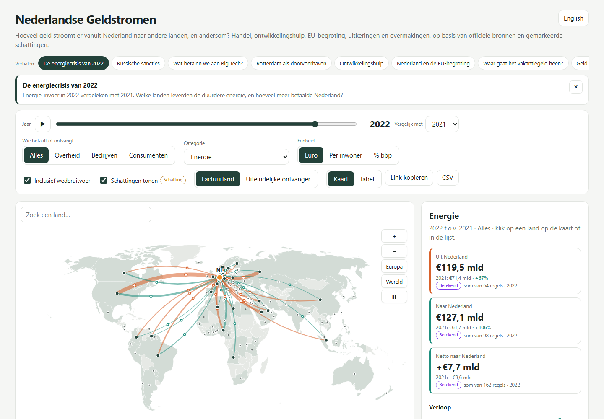
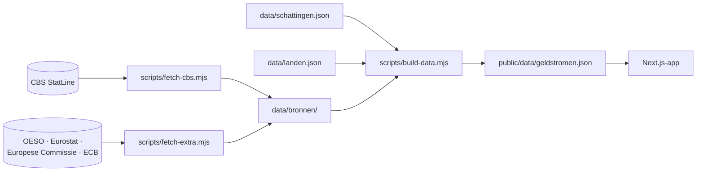

<div align="center">

# Nederlandse Geldstromen

**Hoeveel geld stroomt er vanuit Nederland naar andere landen, en andersom?**

Een interactieve wereldkaart van handel, ontwikkelingshulp, EU-begroting, uitkeringen en overmakingen,
op basis van officiële bronnen, met eerlijke labels voor wat officieel, berekend of geschat is.

[](LICENSE)


*[English summary below](#english)*

</div>

## Wat laat het zien?

Klik op een land en je ziet hoeveel geld Nederland daarheen stuurt, hoeveel er terugkomt, het saldo, de
verdeling per categorie en het verloop sinds 2002. Elk bedrag heeft een bron, een jaar en een label:

| Label | Betekenis |
|---|---|
|  | Direct uit een officiële statistiek (CBS, OESO, Eurostat, Europese Commissie) |
|  | Afgeleid uit officiële cijfers: totaal minus energie, een aandeel wederuitvoer, omgerekend van dollars |
|  | Uit Kamerstukken, jaarverslagen of journalistiek onderzoek, altijd met bron |

**Enkele cijfers uit de data**

- In 2025 ging er €117,4 mld van Nederland naar de VS en kwam er €81,9 mld terug. Zonder wederuitvoer
  (goederen die alleen via Rotterdam doorreizen) is dat €83,1 mld tegenover €72,3 mld.
- In 2024 betaalde Nederland €21,2 mld aan de VS voor het gebruik van intellectueel eigendom.
- Naar Rusland ging in 2021 nog €19,5 mld; in 2024 was dat €3,5 mld.
- Nederland droeg in 2024 €7,5 mld af aan de EU-begroting (inclusief invoerrechten); de EU gaf €4,5 mld uit
  in Nederland.

## Functies

- 🗺️ **Interactieve kaart**: zoomen, slepen, hover-tooltips en rustig bewegende geldstromen.
- 📖 **Verhalen**: één klik zet de kaart op een vast beeld, zoals "De energiecrisis van 2022",
  "Russische sancties" of "Wat betalen we aan Big Tech?".
- 📅 **Jaarschuif 2002–2025** met afspeelknop, en **twee jaren vergelijken** met de groei in procenten.
- 🔎 **Zoekveld**, dat ook kleine landen als Luxemburg en Singapore vindt (ook op de Engelse naam).
- 🏷️ **Filters** op wie betaalt (overheid, bedrijven, consumenten) en op tien categorieën: goederen, energie,
  diensten, IT/cloud, intellectueel eigendom, defensie, ontwikkelingshulp, EU-begroting, uitkeringen en
  overmakingen.
- 💶 **Eenheden**: euro, per inwoner of als % van het bbp.
- 🚢 **Met of zonder wederuitvoer**.
- 🇮🇪→🇺🇸 **Factuurland of uiteindelijke ontvanger**: IT-diensten die Amerikaanse techbedrijven vanuit Ierland
  factureren, toerekenen aan de VS.
- 🔍 **Schattingen aan/uit**.
- 📋 **Tabelweergave en CSV-download**.
- 🔗 **Deelbare link**: alle instellingen, het verhaal en de taal staan in de URL.
- 🌍 **Nederlands en Engels**.



## Snel starten

```bash
git clone https://github.com/ProAdmin007/nederlandse-geldstromen.git
cd nederlandse-geldstromen
npm install
npm run dev
```

Open http://localhost:3000. De verwerkte data zit in de repository; je hoeft niets op te halen.

## Hoe het werkt



Er is geen database en geen backend. `npm run build` maakt een statische site die op elke webhost werkt.

### Bronnen

| Bron | Gebruikt voor |
|---|---|
| CBS [85427NED](https://opendata.cbs.nl/statline/#/CBS/nl/dataset/85427NED/table), [83028NED](https://opendata.cbs.nl/statline/#/CBS/nl/dataset/83028NED/table) | Goederen en energie per land (2015–2025; 2002–2014 oude methode), wederuitvoer |
| CBS [85940NED](https://opendata.cbs.nl/statline/#/CBS/nl/dataset/85940NED/table) | Deel van de invoer dat bestemd is voor wederuitvoer |
| CBS [84765NED](https://opendata.cbs.nl/statline/#/CBS/nl/dataset/84765NED/table), [82616NED](https://opendata.cbs.nl/statline/#/CBS/nl/dataset/82616NED/table), [80414ned](https://opendata.cbs.nl/statline/#/CBS/nl/dataset/80414ned/table) | Diensten per land: IT, intellectueel eigendom, reisverkeer, overheid, overig (2003–2025) |
| CBS [85496NED](https://opendata.cbs.nl/statline/#/CBS/nl/dataset/85496NED/table), [85879NED](https://opendata.cbs.nl/statline/#/CBS/nl/dataset/85879NED/table) | Bevolking en bbp |
| [OESO CRS](https://data-explorer.oecd.org/) + [ECB-wisselkoers](https://data.ecb.europa.eu/) | Ontwikkelingshulp per ontvangend land (2002–2024) |
| [Europese Commissie](https://commission.europa.eu/strategy-and-policy/eu-budget/long-term-eu-budget/2021-2027/spending-and-revenue_en) | Afdrachten aan en uitgaven van de EU-begroting (2000–2025) |
| [Eurostat bop_rem6](https://ec.europa.eu/eurostat/databrowser/view/bop_rem6/default/table) | Overmakingen door migranten (betalingsbalans) |
| [Europese Commissie / HIVA](https://hiva.kuleuven.be/nl/onderzoeksmap/thema/verzorgingsstaat/p/Docs/network-statistics-ry-2024/cross-border-pensions-reference-year-2024.pdf) | Wettelijke pensioenen naar en uit EU/EFTA-landen en het VK (2024) |
| [Eurostat fats_activ](https://ec.europa.eu/eurostat/databrowser/view/fats_activ/default/table) | Onderbouwing van de toerekening Ierland → VS |

Schattingen komen uit Kamerstukken (defensie-aankopen), de Kamerbrief over SLM Rijk (IT-leveranciers) en
journalistiek onderzoek (gemeenten en Microsoft). Ze staan allemaal in
[`data/schattingen.json`](data/schattingen.json).

### Methode

- **Niets telt dubbel.** Wederuitvoer en schattingen die al in een officieel cijfer zitten (zoals
  defensie-aankopen binnen goederen) staan als "waarvan"-regel in de data. De app trekt ze er alleen af als
  dat nodig is. De tests controleren dat het officiële totaal blijft kloppen.
- **Breuken in de reeksen blijven zichtbaar.** CBS wisselde van methode in 2014 (diensten), 2015 (goederen)
  en 2020 (diensten herzien). De trendlijn breekt daar af en de app waarschuwt bij vergelijken.
- **Jaren zonder data zijn een gat, geen nul.** Zo lijkt een nog niet gepubliceerd jaar niet op een daling.
- **Sector.** CBS splitst handel niet uit naar wie betaalt. Alleen reisverkeer, overmakingen en pensioenen
  (consumenten) en hulp, EU, uitkeringen en overheidsdiensten (overheid) zijn apart bekend; de rest staat
  onder bedrijven.
- **Beperkingen**, ook in de app vermeld:
  - Maar ~15% van de Nederlandse ontwikkelingshulp is aan een land toe te wijzen.
  - Overmakingen in de statistiek (~€1 mld) zijn veel lager dan de Wereldbank-schatting (USD 7,8 mld).
  - SVB publiceert geen uitkeringen per land; pensioenen zijn er alleen voor Europa en voor 2024.
  - Voor Amazon via Luxemburg bestaat geen cijfer over het Amerikaanse deel; daarom is er geen toerekening.
- **Bewust weggelaten:** inkomens uit beleggingen (vertekend door brievenbusfirma's) en landen met minder dan
  €1 mld handel per jaar, tenzij er andere geldstromen van minstens €25 mln zijn.

## Data bijwerken

```bash
npm run data        # alle bronnen ophalen en omzetten
npm test            # controleren dat alles klopt (31 tests, ook tegen de ruwe bronnen)
```

**Een schatting toevoegen:** zet een regel in `flows` van `data/schattingen.json`, met `partOf` als het
bedrag al in een officieel cijfer zit, een bron in `sources` en een Engelse tekst in `note_en`. Draai daarna
`npm run data:build`.

## Projectstructuur

```
app/                 pagina, layout en stijl
components/          kaart, zijpaneel, tabel, trendgrafiek, zoekveld
lib/calc.ts          alle rekenregels (puur, getest)
lib/i18n.ts          teksten in het Nederlands en Engels
lib/stories.ts       de verhalen
scripts/             bronnen ophalen en data bouwen
data/                ruwe bronnen, schattingen, landenkoppeling
public/data/         gegenereerde dataset voor de app
.github/workflows/   tests, publiceren, maandelijks data bijwerken
```

## Online zetten en automatisch bijwerken

`npm run build` maakt een statische site in `out/`. In `.github/workflows/` staan drie workflows:

| Workflow | Wat |
|---|---|
| `ci.yml` | Typecheck, tests en build bij elke push en pull request |
| `pages.yml` | Publiceert de site op GitHub Pages bij elke push naar `main` |
| `update-data.yml` | Haalt elke maand de nieuwste cijfers op, test ze en publiceert opnieuw als er iets veranderd is |

Zet GitHub Pages aan via Settings → Pages → Source: "GitHub Actions". Netlify of Cloudflare Pages werkt ook
(buildcommando `npm run build`, map `out`; zet `NEXT_PUBLIC_BASE_PATH` als de site in een submap staat).

## English

**Dutch Money Flows** is an interactive map of the money flowing between the Netherlands and the rest of the
world: trade in goods and services (CBS), development aid (OECD), the EU budget (European Commission),
remittances (Eurostat) and cross-border pensions (European Commission / HIVA), from 2002 to 2025. Every amount
shows its source, year and whether it is official, calculated or an estimate. Switch the language with the
button at the top right, or add `?lang=en` to the URL.

## Licentie en bronvermelding

Code: [MIT](LICENSE). Cijfers: © CBS (StatLine, [CC BY 4.0](https://www.cbs.nl/nl-nl/over-ons/website/copyright)),
OESO, Eurostat, Europese Commissie, ECB en de andere genoemde bronnen, volgens hun eigen voorwaarden.
Kaart: [world-atlas](https://github.com/topojson/world-atlas) (Natural Earth).
